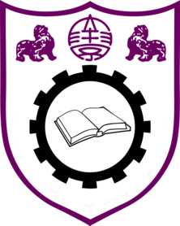

# ML 

<!-- badges: start -->
[](https://github.com/D-Se/ML/actions)
[](https://lifecycle.r-lib.org/articles/stages.html#experimental)
[](https://app.codecov.io/gh/D-Se/ML?branch=master)
<!-- badges: end -->


> Sincerity with Aspiration, Perseverance with Integrity

This repository contains analysis, utilities and workflows for the *NJU 020205D17 Machine Learning* course.

## Quick start

To start modelling, use
``` r
# install.packages("devtools")
devtools::install_github("D-Se/ML")
```

## Getting help
- See `vignette("ML")` for an in-depth introduction of the course and the team.
- For team members, see `vignette("Onboarding")`. 
- See `vignette("Planning")` for planning and continuous integration details.

## Project visualization

[//]: # (Insert targets workflow visualization here)

