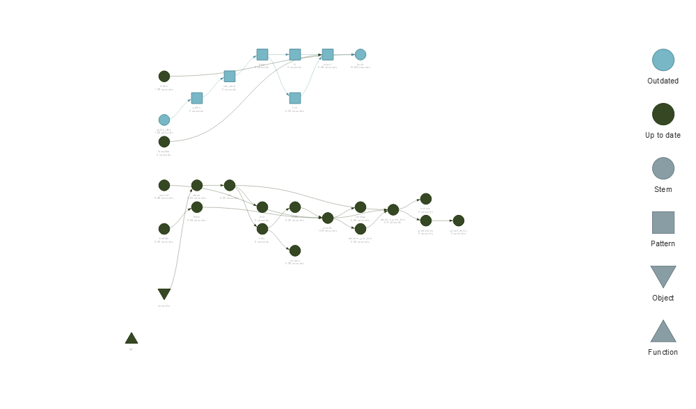

<!-- README.md is generated from README.Rmd. Please edit that file -->

# ML 

<!-- badges: start -->

[](https://github.com/D-Se/ML/actions)
[](https://lifecycle.r-lib.org/articles/stages.html#experimental)
[](https://github.com/D-Se/ML)
[](https://app.codecov.io/gh/D-Se/ML?branch=master)
<!-- badges: end -->

<center>

*Sincerity with Aspiration, Perseverance with Integrity*

</center>

This repository contains analysis, utilities and workflows for the *NJU
020205D17 Machine Learning* course.

<style>
div.green { background-color:#93ed99; border-radius: 5px; padding: 20px;}
</style>

<div class="green">

We are currently <B> recruiting! </B>

</div>

## Quick start

To start modelling, use

``` r
devtools::install_github("D-Se/ML")
```

## Getting help

-   See `vignette("ML")` for an in-depth introduction of the course and
    the team.
-   For team members, see `vignette("Onboarding")`.
-   See `vignette("Planning")` for planning and continuous integration
    details.

## Project visualization

    #> Registered S3 method overwritten by 'tune':
    #>   method                   from   
    #>   required_pkgs.model_spec parsnip


