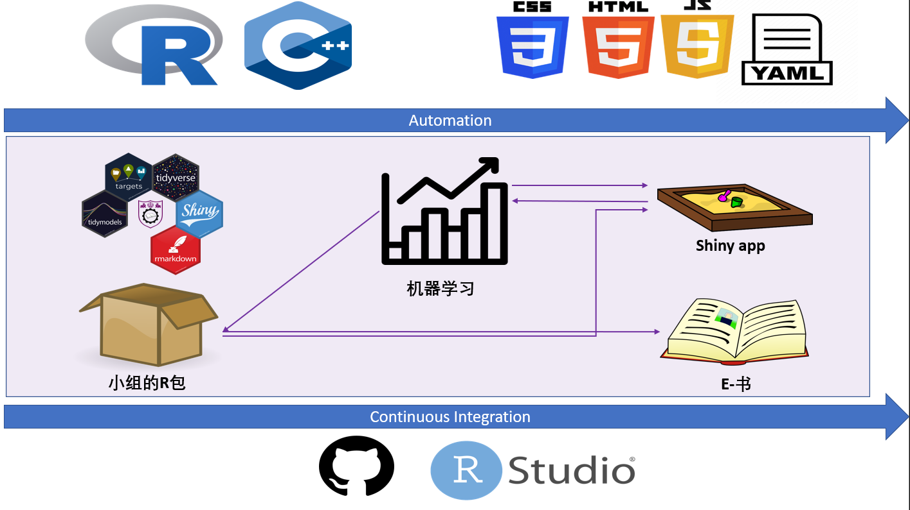

```{r, include = FALSE}
knitr::opts_chunk$set(
  collapse = TRUE,
  comment = "#>",
  fig.path = "man/figures/README-",
  out.width = "100%"
)
```

# ML 

<!-- badges: start -->

[](https://github.com/D-Se/ML/actions) [](https://lifecycle.r-lib.org/articles/stages.html#experimental) [](https://github.com/D-Se/ML) [](https://app.codecov.io/gh/D-Se/ML?branch=master)

<!-- badges: end -->

<center>

*Sincerity with Aspiration, Perseverance with Integrity*

</center>

This repository contains analysis, utilities and workflows for the *NJU 020205D17 Machine Learning* course.

```{=html}
<style>
div.green { background-color:#93ed99; border-radius: 5px; padding: 20px;}
</style>
```

The source code is available in this [Github repo](https://github.com/D-Se/ML). For questions, refer to [Github Discussions](https://github.com/D-Se/ML/discussions) or send an e-mail directly to the maintainer of `ML`, `r paste0(gsub("[<>]", "", strsplit(maintainer("ML"), "<")[[1]] |> trimws()), collapse = " at: ")`.  

## Project Goals

-   *Deliver* a **scalable**, **reproducible** and **continuously integrated** data analysis compendium that:

    -   *Deploys* Machine Learning algorithms,

    -   *Visualizes* model performances & statistical inference,

    -   *Communicates* findings to target audiences in multiple formats.

-   *Display* best practices at the edge of machine learning knowledge using **R**, placing importance on:

    -   *Packaging* approaches using version control,

    -   *Deploying* computationally efficient algorithms,

    -   *Interfacing* modelling & reporting API's,

    -   *Adopting* a functional programming mindset.


## Project deliverables

-   A data analysis compendium,

-   An R package containing `target`-based `tidymodels` and reporting tools,

-   A pipeline-generated `bookdown` book & `shiny` app,

-   Persistent Github repository for future publishing.

<center>


```{r, echo=FALSE, fig.cap="Project Outline", out.width = '100%', out.height="100%"}
knitr::include_graphics("assets/images/project.png")
```

<!-- {width=600px; height=500px} -->

</center>

## Project visualization

*click and drag on the image to inspect or move nodes!*

```{r pipeline, eval=TRUE, include=FALSE}
### TODO: annotate visnetwork with time of last model run
# This chunk is split in two to avoid S3 error issue, see https://github.com/D-Se/ML/issues/13
p <- targets::tar_visnetwork(label = "time")
```

```{r pipeline_plot, echo=FALSE, fig.keep='all', eval=TRUE, fig.align='center', out.extra='angle=90',comment="", message=FALSE, error=FALSE}
p
```

In this image there are already over 25 000 different models, implemented using 12 modelling packages! Each node represents a step in the `targets` core pipeline.

::: note
<center>
When a file in the pipeline is edited, tho dependencies get rerun! 
</center>
:::

For example, if a set of the models fails, in red, the code needs to be looked at. Another example of such dependency is **this** book, which in itself is *parameterized*.

*keras* neural nets, *MARS*, *Random Forests*, *SVM* are already part of the `ML` API. This project uses `R` & `C++` for computation, `JavaScript`, `HTML` & `CSS` for reporting, `YAML`, `TeX` and `AWK` for text formatting. Whether you like **modelling**, **visualizing**, or **communicating**, this projects offers the chance to explore best R practices. And the best part? We don't have to leave RStudio at all for any of it.

::: community
<center>

Here at NJU we are a community. We are open to beginners, advanced users alike. Extensive help documentation is being written to accomodate each group member to be as comfortable and productive as possible!

</center>
:::

Curious to know more, want to see a live coding example? Send me an email or add me on QQ or WeChat!
