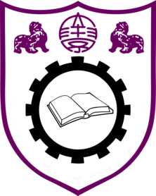

```{r, include = FALSE}
knitr::opts_chunk$set(
  collapse = TRUE,
  comment = "#>"
)
```

<center>

# Welcome!
```{r logo, echo=FALSE, out.height="20%", out.width="20%"}

```

</center>

Hi there! Glad to have you on board. This is a guide to help you help us. If anything is unclear, questions can be asked by posting on [Github Discussions](https://github.com/D-Se/ML/discussions), or by sending an email to `r paste0(gsub("[<>]", "", strsplit(maintainer("ML"), "<")[[1]] |> trimws()), collapse = " at: ")`.

## Project Goals

-   *Deliver* a **scalable**, **reproducible** and **continuously integrated** data analysis compendium that:

    -   *Deploys* Machine Learning algorithms,

    -   *Visualizes* model performances & statistical inference,

    -   *Communicates* findings to target audiences.

-   *Display* best practices at the edge of machine learning knowledge using **R**, placing importance on:

    -   *Packaging* approaches using version control,

    -   *Deploying* Computationally efficient algorithms,

    -   *Interfacing* modelling & reporting API's,

    -   *Adopting* a functional programming mindset.

<center>

## Getting started

1.  Administration

    1.  Sign the non-disclose agreement (Only in effect until **August 31, 2022**).

2.  Connect RStudio to github [guide](https://happygitwithr.com/rstudio-git-github.html)

# External Resources

</center>

## general

-   [Link portal](https://www.bigbookofr.com/index.html)

-   [Book selection](https://bookdown.org/home/archive/)

## packages

This is a list of resources for the R packages used in this project.

-   [targets](https://books.ropensci.org/targets/)

-   [rmarkdown](https://bookdown.org/yihui/rmarkdown/)

-   [tidymodels](https://www.tmwr.org/)

-   [tidymodels Feature Engineering & Selection](https://bookdown.org/max/FES/)

## books

-   [Deep Learning](https://github.com/janishar/mit-deep-learning-book-pdf/tree/master/complete-book-pdf)

## models

A list of useful resources for the models developed in the project.

<center>

# Code development

</center>

A list of useful version controlled R project commands:

-   `devtools::document()` to update (locally) the package using `roxygen2.`

-   `lintr::lint_dir()` to use static code analysis for code formatting checks.

`lintr` is useful to check code style line-by-line and make adjustments on the fly. It will open an interface in the RStudio *Markers* pane where individual lines can be clicked. On a click, the relevant code snippet will be opened in the editor. This command is also run automatically on commits to the master branch of Github repo, viewable as comments in the Github Actions pane.

-   `covr::report()` for visual inspection of unit test coverage.

-   `usethis::edit_r_profile()` to run functions on startup.

An example of Donalds' ML-project specific R profile line: runs `library(devtools)` and imports specific `targets` functions as an alias for brevity.

```{r sampleRprofile, eval=FALSE, include=TRUE}
if (tryCatch(endsWith(readLines("DESCRIPTION", 1), "ML"), warning = function(x) F)) {
  #library(devtools, quietly = T)
  cat("loading devtools & select targets functions\n")
  box::use(
    devtools[...],
    targets[make = tar_make,
            make_future = tar_make_future,
            grab = tar_read]
  )
}
```
